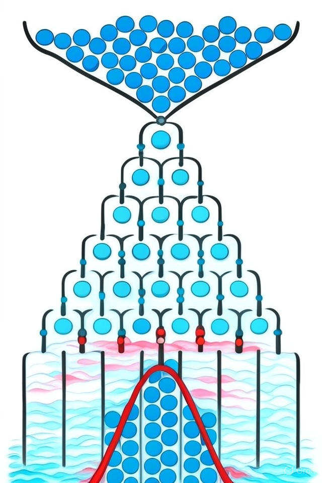

# Classical Galton Board Simulation

Welcome to the Classical Galton Board project! This initiative is part of the Quantum Walks and Monte Carlo program, submitted for WISER 2025. The simulation employs Monte Carlo methods to model random walks, producing a binomial distribution that closely mirrors neutron scattering in nuclear reactors.

## Overview

The Galton Board is a fascinating device where balls drop through a series of pegs, bouncing left or right randomly. As the number of layers increases, the distribution of balls forms a binomial distribution approximating a Gaussian curve. This random walk process aligns with Monte Carlo neutron transport, where neutrons scatter through materials in a reactor. In the `classical_galton_box.ipynb` notebook, this process is simulated using Monte Carlo methods, tracking ball paths to generate distributions resembling neutron flux in nuclear reactors.

<p align="center">
  
</p>

## Application to Monte Carlo Neutron Transport

The classical Galton Board simulation relates directly to neutron transport, vital for nuclear reactor research:

- **Neutron Scattering**: Each ball's random path represents a neutron's trajectory as it collides with atoms in reactor materials, such as uranium fuel and graphite moderators.
- **Monte Carlo Method**: The simulation randomly selects left (-1) or right (+1) moves at each layer, mirroring how Monte Carlo methods track neutron paths to predict neutron flux or shielding effectiveness.
- **Relevance**: This simulation serves as a foundational model for neutron scattering, essential for optimizing reactor core designs and ensuring safety, including radiation shield design.
- **Link to Quantum**: The classical simulation provides a basis for quantum walk-based simulations (`2_Quantum GB`), which may offer computational speed-ups for neutron transport, as suggested by Montanaro’s work (arXiv:1504.06987).

## Files and Structure

The project includes:

- **classical_galton_box.ipynb**: A Jupyter notebook implementing the Monte Carlo simulation for the Galton Board, testing configurations with 5, 10, 15, 20, and 25 layers.
- **results/**:
  - `galton_box_5_layers.png`: Histogram for 5 layers.
  - `galton_box_10_layers.png`: Histogram for 10 layers.
  - `galton_box_15_layers.png`: Histogram for 15 layers.
  - `galton_box_20_layers.png`: Histogram for 20 layers.
  - `galton_box_25_layers.png`: Histogram for 25 layers.
- **Classical_README.md**: This document, detailing the task and its application to neutron transport.

## Setup and Running Instructions

To begin, follow these steps:

1. **Prerequisites**:
   - Install dependencies listed in the root `requirements.txt`:
     - NumPy (1.26.4)
     - Matplotlib (3.9.2)
   - Run this command:
     ```bash
     pip install -r ../requirements.txt
     ```

2. **Run the Simulation**:
   - Launch Jupyter Notebook with:
     ```bash
     jupyter notebook classical_galton_box.ipynb
     ```
   - Execute all cells to simulate the Galton Board for 5, 10, 15, 20, and 25 layers, with a default of 10,000 trials.

3. **Outputs**:
   - Generated plots in the `results/` directory illustrate binomial distributions resembling neutron flux patterns in reactors.
   - For example, `galton_box_10_layers.png` displays a bell-shaped curve, similar to neutron distribution after scattering.

## How It Works

A brief overview of the simulation:

- **Simulation Mechanics**:
  - Monte Carlo methods simulate balls falling through a Galton Board.
  - Each ball randomly selects left (-1) or right (+1) at each layer, accumulating the final position.
  - Final positions are plotted as a histogram, forming a binomial distribution.

- **Parameters**:
  - Layers: Number of peg rows (5, 10, 15, 20, 25).
  - Trials: Number of balls (default: 10,000).

- **Output**: Histograms show the probability distribution of final positions, approximating a Gaussian curve for higher layers, similar to neutron flux in nuclear reactors.

- **Complexity**:
  - Time Complexity: O(layers * trials), as each ball processes multiple steps.
  - Space Complexity: O(trials) for storing position data.

## Relevance to WISER 2025

- **Technical Merit**: The simulation effectively generates binomial distributions, validated by high-quality plots (DPI=300) resembling neutron flux patterns.
- **Communication**: Clear visualizations and documentation explain the neutron transport analogy, making it accessible to judges and researchers.
- **Novelty**: This project connects classical Monte Carlo methods to neutron transport challenges, providing a baseline for exploring quantum speed-ups in subsequent tasks.

## Next Steps

Plans include:

- Compare results with quantum simulations in `2_Quantum GB/quantum_galton_box.ipynb` to assess potential speed-ups for neutron transport.
- Review `task_5_comparison` for a method-wise analysis, including accuracy for neutron transport applications.
- Explore `src/educational_tool.ipynb` for an interactive explanation of neutron transport using this simulation.

## Team

- **Quanto Gladiators**: A group of up to 3 members, collaborating via Discord for task division and updates.
