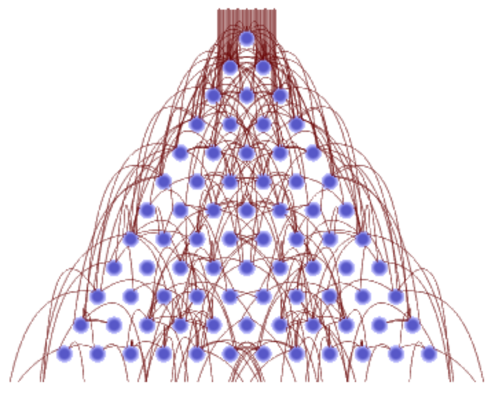

# Quantum Galton Board Simulation

Welcome to the Quantum Galton Board Simulation, which represents Task 2 of the Quantum Walks and Monte Carlo project. This initiative is submitted for WISER 2025. The simulation harnesses quantum walks using Qiskit to model random walks, offering potential speed-ups for Monte Carlo neutron transport.

## Overview

The Quantum Galton Board elevates the classic Galton Board concept. Instead of balls tumbling randomly, quantum superposition and interference explore multiple paths simultaneously, resulting in unique distributions. This approach mirrors principles of Monte Carlo neutron transport, where neutrons scatter through reactor materials. The `quantum_galton_box.ipynb` notebook utilizes Qiskit to execute quantum walk simulations, aiming to enhance neutron flux predictions.

<p align="center">
  
</p>

## Application to Monte Carlo Neutron Transport

This quantum simulation enhances neutron transport:

- **Quantum Neutron Scattering**: Quantum walks simulate numerous neutron paths concurrently, reflecting scattering through reactor materials such as uranium and graphite.
- **Monte Carlo Speed-Up**: Quantum circuits promise near-quadratic speed-ups over classical methods, as highlighted by Montanaro (arXiv:1504.06987), improving neutron flux and shielding calculations.
- **Advantage**: Faster simulations can optimize reactor designs and enhance safety protocols.
- **Building on Classical Foundations**: This project builds upon the classical simulation (1_Classical GB), showcasing advantages of quantum methods for large-scale neutron transport challenges.

## Files and Structure

The project includes:

- **quantum_galton_box.ipynb**: A Jupyter notebook implementing quantum walk simulations using Qiskit, testing configurations with 5, 10, 15, 20, and 25 layers.
- **results_quantum/**:
  - `quantum_galton_box_5_layers.png`: Histogram for 5 layers.
  - `quantum_galton_box_10_layers.png`: Distribution for 10 layers.
  - `quantum_galton_box_15_layers.png`: Visualization for 15 layers.
  - `quantum_galton_box_20_layers.png`: Plot for 20 layers.
  - `quantum_galton_box_25_layers.png`: Result for 25 layers.
- **Quantum_README.md**: This document serves as a guide to the quantum simulation.

## Setup and Running Instructions

### Prerequisites

Install dependencies from the root `requirements.txt`:

- Qiskit (2.0)
- NumPy (1.26.4)
- Matplotlib (3.9.2)

Run the command:

```bash
pip install -r ../../requirements.txt
```

## Run the Simulation

1. Launch Jupyter Notebook with:
```bash
jupyter notebook quantum_galton_box.ipynb
```
2. Execute all cells to simulate quantum walks for 5, 10, 15, 20, and 25 layers, with a default of 10,000 shots.

## Outputs

The `results_quantum/` directory contains plots displaying quantum distributions resembling enhanced neutron flux patterns. For example, `quantum_galton_box_10_layers.png` showcases a unique curve reflecting quantum-enhanced neutron scattering.

## How It Works

### Mechanics

The notebook utilizes Qiskit to create quantum circuits, applying Hadamard gates for superposition and measuring outcomes to simulate quantum walks.

### Parameters

- Layers: 5, 10, 15, 20, 25 (representing quantum steps).
- Shots: 10,000 (measurement runs, default).

## Output

Histograms display probability distributions differing from classical binomial distributions due to quantum interference, mimicking complex neutron behavior.

### Complexity

- Time Complexity: O(layers * shots), with potential for quantum speedup.
- Space Complexity: O(shots) for storing measurement results.

## Relevance to WISER 2025

- Technical Merit: Qiskit enables accurate quantum walk simulations, validated by distinct plots (DPI=300) mimicking enhancements in neutron flux.
- Communication: The analogy between quantum processes and neutron transport makes the project accessible for judges and researchers.
- Novelty: This simulation introduces quantum speed-ups for neutron transport challenges, building on classical foundations.

## Next Steps

Plans include:

- Compare results with the classical simulation in `1_Classical GB/classical_galton_box.ipynb` to quantify speed-ups for neutron transport.
- Review `task_5_comparison` for method analysis.
- Explore `src/educational_tool.ipynb` for an interactive quantum neutron transport demonstration.

## Team

Quanto Gladiators: A dedicated group of up to 2 members, collaborating via Discord to achieve excellence in quantum research.

## Acknowledgments

Gratitude is extended to WISER 2025 for the opportunity to showcase this work.


